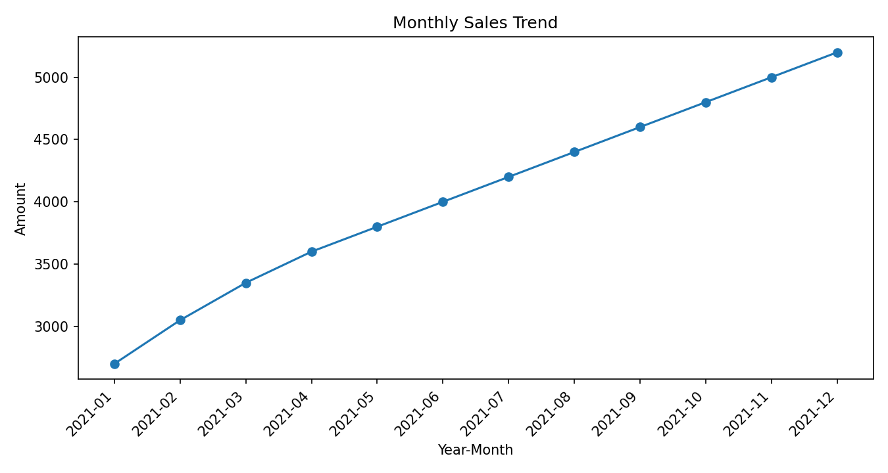
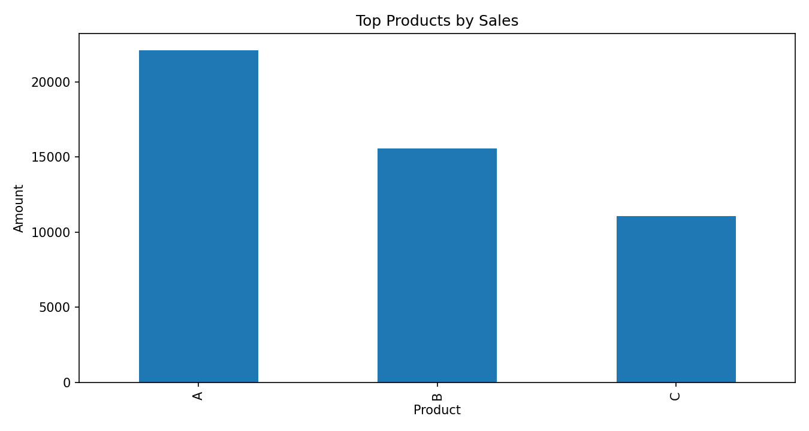

[한국어 버전 보기](README_ko.md)
## Reports

- [English Sales Analysis Report](sales_analysis.md)  
- [한국어 판매 분석 보고서](sales_analysis_ko.md)

---

## English Version

### Overview
This project combines multiple CSV files into one dataset and analyzes sales data to automatically generate summary reports and visualizations.  
It leverages Python, pandas, and matplotlib to simplify repetitive data processing tasks.

---

### Features
- Merge multiple CSV files
- Summarize sales by date/product
- Automatically generate Excel reports
- Visualize sales with charts

---

### How to Use
1. Run `combine_files.py` → Merge CSV files  
2. Run `analyze_sales.py` → Generate sales summary and charts  
3. Check results in the `output/` folder  

---

### Sample Output
- Combined CSV file: `output/combined.csv`  
- Sales summary report: `output/sales_summary.xlsx`  
- Sales chart: 

---

### Requirements
Python 3.9+ recommended, with the following libraries:

## 📊 Reports & Analysis

- [Sales Summary Report (English)](sales_summary.md)
- [매출 요약 보고서 (한국어)](sales_summary_ko.md)
- [Sales Analysis (English)](sales_analysis.md)
- [매출 분석 보고서 (한국어)](sales_analysis_ko.md)

## 📈 Charts
- 차트 생성 코드: [charts.py](charts.py)
- 데이터 파일: [combined_sales.csv](combined_sales.csv)

## 📈 Charts (Preview)

